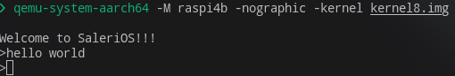

# SaleriOS

SaleriOS is a operating system designed for the 64-bit Raspberry Pi 4.

## Demonstration

The image below shows `SaleriOS` booting successfully within the QEMU emulator. The system is running on a simulated Raspberry Pi 4B (`raspi4b`) in headless mode, with the output redirected to the serial console.

After booting, the OS displays a welcome message and provides a simple command-line interface, which is shown accepting the "hello world" command.



This demonstrates the basic boot process and the functionality of the UART driver and shell. The command used to launch this emulation is:

```bash
qemu-system-aarch64 -M raspi4b -nographic -kernel kernel8.img
